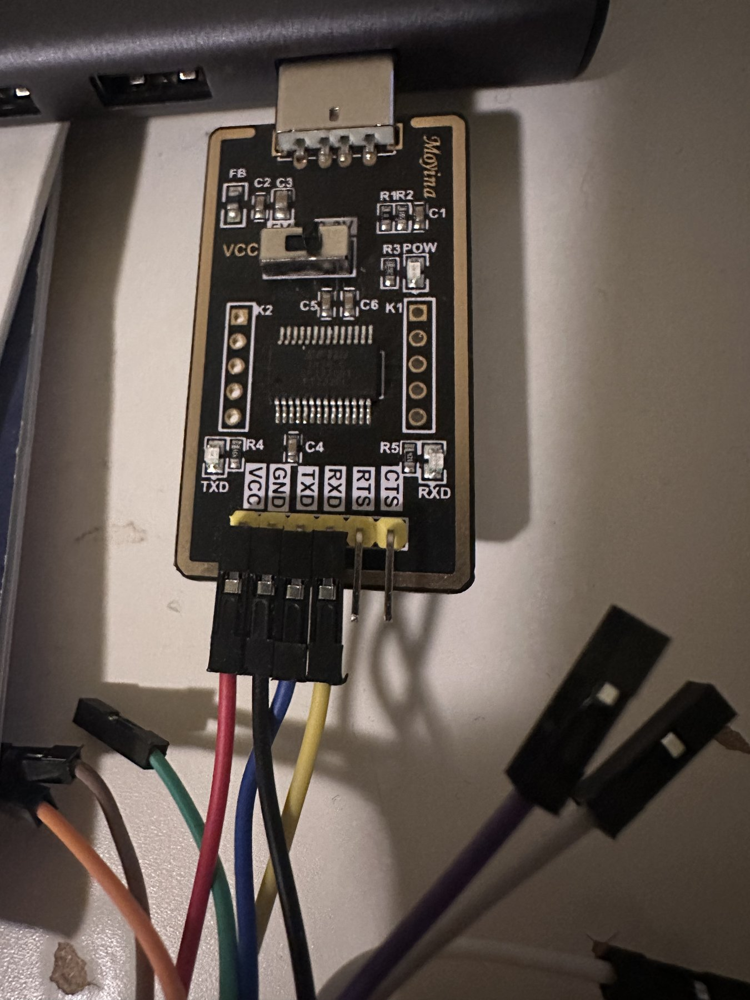
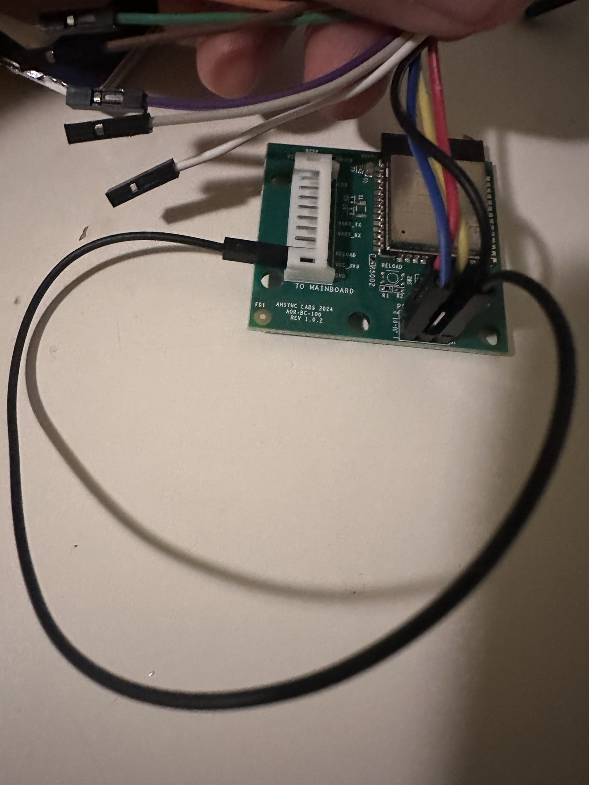

# Flashing an AOIA-2-series controller

This procedure applies to the Async Labs AOR-BC-100 Rev 1.0.2 board with an ESP32-WROOM-32E. It replaces the OEM Wi-Fi firmware. Back up before writing.

## Safety

- Use an FTDI adapter with **3.3 V logic and 3.3 V VCC**. Never apply 5 V.
- Disconnect appliance connector **J1** before connecting FTDI power. Never power the board from J1 and FTDI simultaneously.
- Do not drive programming-header pin 3; its reset behavior is unsupported.
- Do not run `erase-flash`.
- A flash backup may contain device-specific credentials. Keep it private and outside this repository.

## Programming header

Viewed from the component side, square pad = pin 1:

```text
upper row:  2  4  6
lower row:  1  3  5
```

| Pin | ESP32 function                           | FTDI connection                     |
|----:|------------------------------------------|-------------------------------------|
|   1 | `GPIO3` / `U0RXD`                        | TXD                                 |
|   2 | 3.3 V                                    | 3V3                                 |
|   3 | reset behavior unsupported; do not drive | —                                   |
|   4 | `GPIO1` / `U0TXD`                        | RXD                                 |
|   5 | `GPIO0` / BOOT                           | jumper to J1 GND to enter bootloader |
|   6 | Ground                                   | GND                                 |

| | |
|---|---|
|  |  |

Connect FTDI GND to pin 6. Use J1 GND for the separate BOOT jumper.

The programming UART is separate from appliance J1: `GPIO17` is appliance TX and `GPIO16` is appliance RX.

## Bench setup

Use a 3.3 V FTDI adapter and keep J1 disconnected during serial programming.

| | |
|---|---|
|  |  |

## Enter the ROM downloader

1. Disconnect J1.
2. Wire FTDI as above.
3. Jumper pin **5** to the **GND** pin on J1.
4. Apply FTDI power.
5. Run a read-only check:

   ```sh
   PORT=/dev/ttyUSB0                # macOS commonly: /dev/cu.usbserial-*
   ESPTOOL=esptool                  # install: python3 -m pip install esptool
   "$ESPTOOL" --chip esp32 --port "$PORT" --baud 115200 chip-id
   ```

Re-enter bootloader mode before each later serial command if the board cannot connect.

## Back up the OEM flash

The controller has 4 MiB of flash. Both commands are read-only:

```sh
umask 077
BACKUP_DIR="$HOME/Backups/air-oasis"
mkdir -p "$BACKUP_DIR"
chmod 700 "$BACKUP_DIR"
BACKUP="$BACKUP_DIR/aoia-stock-$(date +%F).bin"
BAUD=460800                         # use 115200 if unreliable

"$ESPTOOL" --chip esp32 --port "$PORT" --baud "$BAUD" \
  read-flash 0x0 0x400000 "$BACKUP"
"$ESPTOOL" --chip esp32 --port "$PORT" --baud "$BAUD" \
  verify-flash 0x0 "$BACKUP"
```

Require `4194304` bytes and a successful verification before proceeding.

## Install ESPHome

1. Copy `secrets.yaml.example` to `secrets.yaml` and set Wi-Fi, API, OTA, and fallback-AP values.
2. Use `aoia-2.yaml`. For multiple controllers, give each configuration a unique `device_name`:

   ```sh
   CONFIG=aoia-2.yaml
   esphome config "$CONFIG"
   esphome run "$CONFIG" --device "$PORT"
   ```

3. ESPHome reports a successful upload, then remove FTDI power and the BOOT-to-J1-GND jumper.
4. Disconnect FTDI completely, reconnect J1, and apply normal appliance power.
5. Wait for the device to join Wi-Fi and add it through the ESPHome integration.

## OTA updates

With J1 connected and normal appliance power, do not attach FTDI:

```sh
esphome run "$CONFIG" --device '<device_name>.local' --no-logs
```

## Restore OEM firmware

Disconnect J1, re-enter ROM download mode, then write and verify the full private backup:

```sh
"$ESPTOOL" --chip esp32 --port "$PORT" --baud "$BAUD" \
  write-flash 0x0 "$BACKUP"
"$ESPTOOL" --chip esp32 --port "$PORT" --baud "$BAUD" \
  verify-flash 0x0 "$BACKUP"
```

Remove FTDI power and the boot jumper before reconnecting J1. Restoring OEM firmware may require its original Wi-Fi provisioning.
