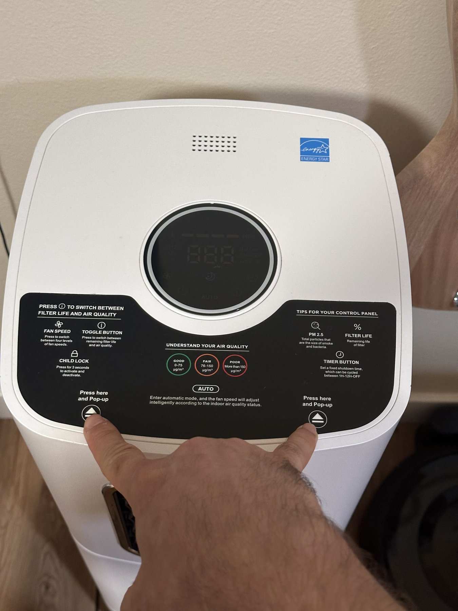
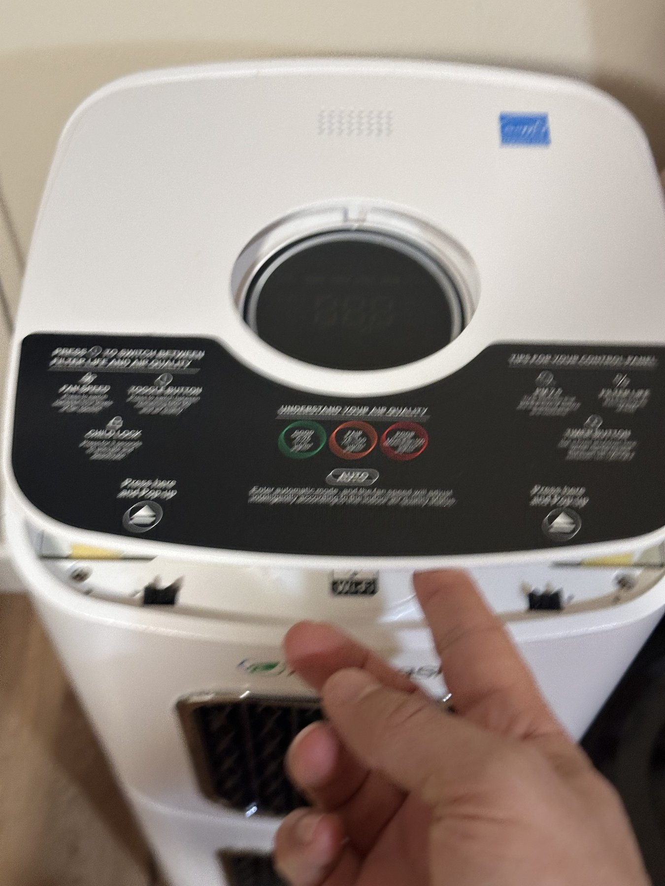
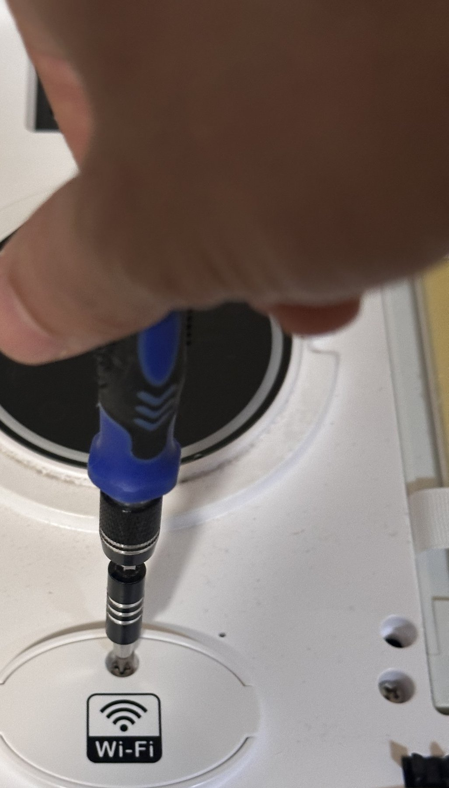
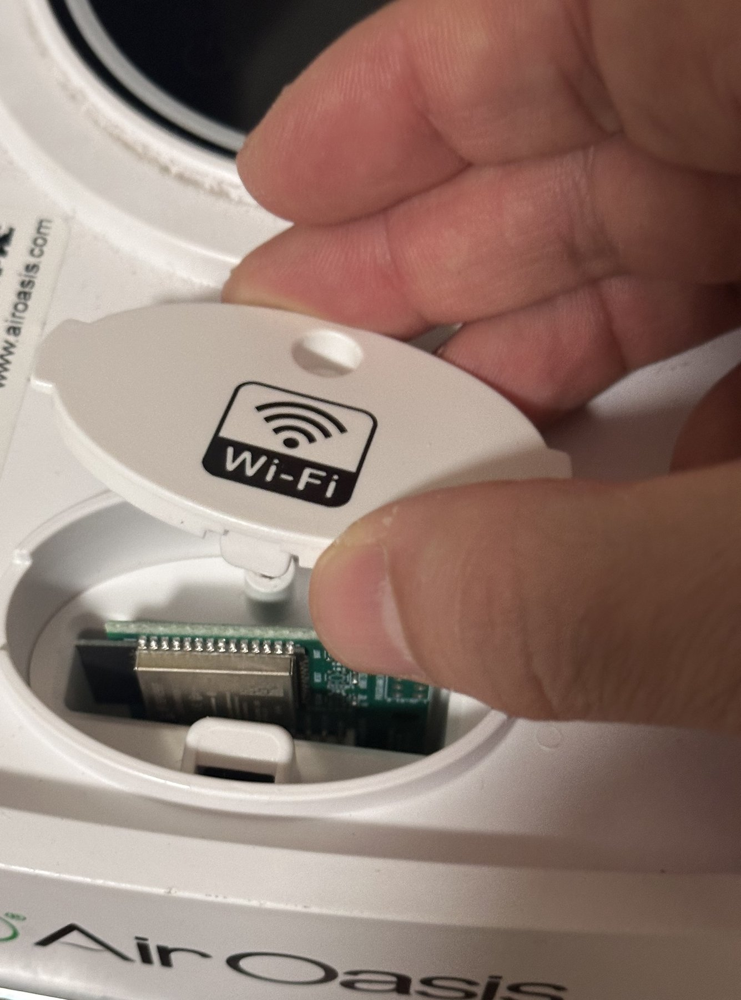
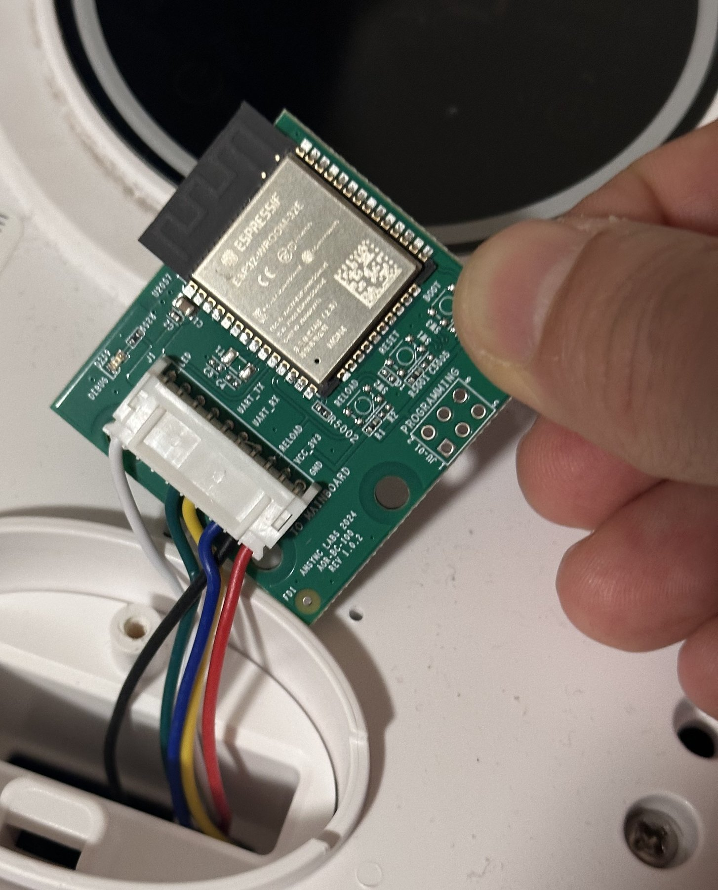
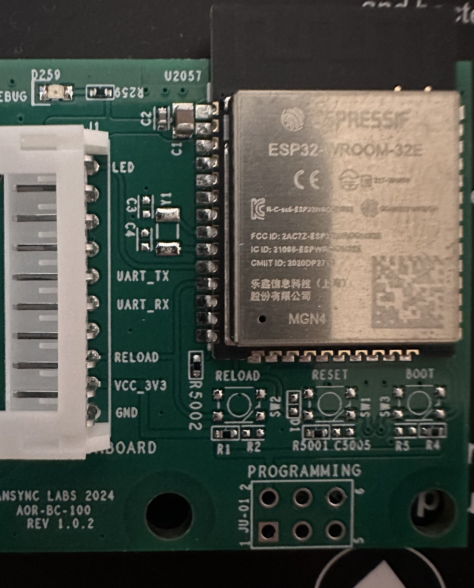
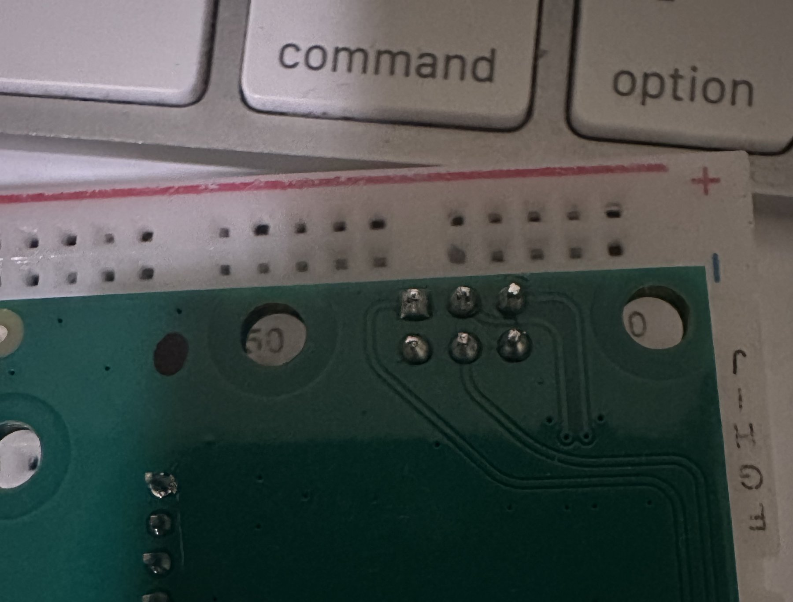

# Accessing the controller

These photos show the controller-access sequence for a compatible AOIA-2-series purifier. Cabinet details can vary by model.

> [!WARNING]
> Unplug the purifier before opening it. The controller is powered from J1; do not connect an FTDI adapter until J1 is disconnected. Continue with [FLASHING.md](FLASHING.md) only after the controller is removed.

## Open the upper panel

Remove the upper panel to reach the Wi-Fi access area.

| | |
|---|---|
|  |  |

## Expose the controller

Remove the Wi-Fi access cover, then disconnect J1 and remove the controller.

| | | |
|---|---|---|
|  |  |  |

## Identify the programming connection

The controller has the appliance connector J1 and a separate unpopulated 2×3 programming header. The component-side and reverse-side views below help locate and populate the header.

| | |
|---|---|
|  |  |

The pinout, FTDI wiring, backup, and flashing procedure are in [FLASHING.md](FLASHING.md).
